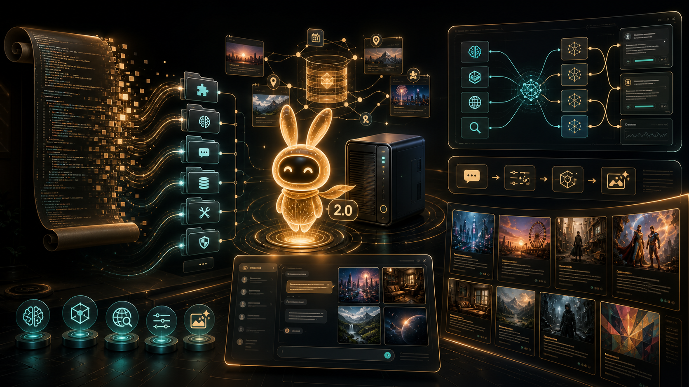

# Wangcai 2.1 / 旺财2.1



Wangcai 2.1 是一个面向家庭本地部署的 AI 助手网页端。它把本地/联网大模型、长期记忆、联网搜索、多模态图片输入、HiDream 文生图、固定角色库、图文成果库、后台空闲创作和管理员分析模式整合在一个 FastAPI Web 系统里。

2.1 的核心变化是：旺财从“图文创作助手”继续进化为带固定演员表的小剧场系统。你可以在角色库里创建、修改、补图和管理角色，让角色以全局索引的形式参与后续聊天、绘图和成果创作；成果库不再只围绕临时生成的陌生角色转，而可以持续调用已沉淀的角色设定、形象、性格和剧情指令。

2.0 引入的视觉创作链路仍然是 2.1 的基础：你可以在聊天里直接点“画图”，让旺财先把自然语言改写成适合图像模型的英文 prompt，再调用图像生成服务一次生成 4 张图，直接预览和下载；后台成果也升级为图文作品，每篇成果至少带一张主题配图，并在成果库里以封面图作为主要展示对象。

这张图概括了从 1.0 到 2.0 的开发旅程：最早的单体服务被拆成 `qwen_app` 模块，长期记忆从聊天记录里长出来，分析模式把 prompt、召回、trace 和模型调用摊开给开发者看，最终 HiDream 生图和图文成果库让旺财开始把文字想象变成图片。

和常见的云端聊天机器人或通用 Agent 不同，旺财的重点不是一次性问答，而是“长期生活在你家里的私人 AI”：

- 更重视图像生成：Wangcai 2.1 内置文生图工作流，支持 HiDream-O1-Image-Dev-2604 等本地图像服务；聊天和分析模式都可以切换到画图，本轮消息会先进行 prompt 翻译、分类和优化，再生成固定 4 张图片。专业 prompt 会尽量直译保留，自然语言描述会被扩展成更适合出图的视觉指令，连续修改会基于上一轮 optimized prompt 继续修正。
- 更重视记忆：豆包、DeepSeek、ChatGPT 一类产品通常以单次会话或云端账号记忆为中心；旺财围绕本地浏览器身份、长期记忆库、未来事件和用户偏好构建，可以把会议、称呼、习惯、禁忌和长期设定持续带入对话。
- 更重视图文成果：除了聊天，旺财会在空闲时创作小说、诗歌、剧本、世界观和连续作品；2.0 起后台成果会规划配图，成果库卡片优先展示封面，详情页把图片居中穿插进正文，而不是只堆文字。
- 更重视固定角色：2.1 起新增角色库，角色的形象、性格、背景、绘图 prompt、参考图和成果小剧场指令可以长期沉淀；角色会同步为全局 `characters` 记忆供成果和相关聊天召回，但普通聊天不会随机改写角色库。
- 更重视本地化：聊天模型、后台模型、embedding、图像生成模型、数据库、管理员密码和聊天记录都可以放在自己的机器或内网服务器上；仓库不包含任何模型权重、私有记忆、日志、代理地址或个人参数。
- 更重视可观察性：分析模式可以看到完整 prompt、记忆召回、embedding、联网搜索、网页摘要、模型调用时长和后台整理过程，适合调试一个真正有长期记忆的助手。
- 更重视可改造性：前端无构建步骤，后端是 FastAPI 单体，适合家庭服务器、宿舍服务器或个人工作站按自己的模型、代理和创作方向改造。

本仓库只包含 Web 服务代码，不包含任何模型权重、数据库、聊天记录、记忆、日志、私有 prompt、代理地址或本地参数配置。

## 功能概览

- 网页聊天：浏览器打开即创建新会话，支持连续对话、流式输出、停止生成、reset。
- 上段对话续接：同一个浏览器设备可以加载更早 session，并把当前 session 变成旧 session 的延续。
- 设备身份：首次打开网页生成浏览器本地 `device_id`，用于区分不同用户。
- 记忆绑定：多个设备可以绑定同一个共享用户 ID，按需共享记忆、事件和历史聊天记录。
- 长期记忆：后台从用户发言中整理身份、偏好、规则、事件、风险等记忆，并用 embedding 做召回。
- 未来事件提醒：带时间的 event 会在开场和相关对话里被读取，用于提醒日程、会议、截止时间等。
- 联网搜索：可按需开启搜索，搜索过程会在状态栏显示。
- 多模态图片：支持图片上传；过大图片会在服务端用 Pillow 压缩后再送入多模态模型。
- 聊天画图：输入区有“画图”按钮，开启后本轮消息进入图像生成流程，默认生成 4 张图，支持预览和下载。
- 图像 prompt 优化：中文输入会先翻译成英文，再由 prompt agent 判断是自然语言、专业 prompt 还是补充修改；专业 prompt 尽量不改写，只做英文保真转换。
- 图像记忆参考：画图前可按需读取长期记忆作为视觉参考，但本轮用户明确要求始终优先。
- 固定角色库：成果库入口提供角色库页面，可创建、编辑、删除角色，管理头像、参考照片、关系、绘图 prompt 和成果小剧场指令。
- 角色场景图：角色库聊天可以生成多角色同框、对战或剧情场景图，并把图片绑定回参与角色。
- 分析模式：管理员可查看完整 prompt、记忆召回、embedding 调用、搜索过程、网页摘要、画图 prompt 优化、图像生成和模型调用时长。
- 图文成果页：空闲时后台 agent 可写小说、诗歌、剧本、世界观等作品，并为成果生成主题配图；成果支持封面、正文插图、下载、分类、点赞、评论、排序、随机和分页展示。

## Wangcai 2.1 更新摘要

- 新增角色库主线：在成果库中加入角色库入口，集中处理角色创建、修改、删除、头像、照片、参考图、关系和成果小剧场指令。
- 新增角色编辑聊天：角色库左侧提供专用聊天区，用后台大模型理解用户对角色设定、剧情安排和图片的修改；普通聊天和分析模式不再随机触发角色写入。
- 新增全局角色索引：固定角色会同步为 `characters` 类型的全局 embedding 记忆，供聊天、绘图和成果小剧场按语义召回；这些角色记忆不混入单个用户的个人记忆列表。
- 新增角色场景图：角色库可生成多角色同框、对战、相遇或小剧场画面，并把生成图绑定到参与角色，后续成果可继续复用。
- 成果系统强化小剧场意识：成果生成可参考固定角色、角色关系和导演指令，减少长期作品中角色反复漂移。
- 角色库 UI 改进：角色卡片统一图片条高度，摘要优先展示背景和性格，图片支持删除、下载和全屏浏览；移动端聊天滚动和头部布局进一步修复。
- 记忆后台改进：角色创建/修改日志不再写成 anonymous event 记忆，角色资料改由角色库事件和全局 `characters` 记忆维护；记忆管理页把新增时间作为标签展示。
- 分析模式改进：后台明细标题继续中文化，`memory_query_planner` 显示为更易懂的“记忆检索规划”，移动端 trace 区固定在聊天内容下方，避免漂浮遮挡。
- 模型配置改进：模型预设补充 OpenAI、DeepSeek、智谱、Qwen、豆包等常用供应商，并支持全局保存供应商级 API key 状态和联网代理设置。
- 发布边界更清晰：公开仓库只包含代码、静态资源、公开说明和版本日志；生成角色图片、成果数据库、聊天记录、私有记忆、日志、密钥、代理和本地配置不上传。

## Wangcai 2.0 更新摘要

- 新增 HiDream 文生图链路：支持本地 `HiDream-O1-Image-Dev-2604` 图像服务，也可通过模型配置接入其他兼容图像生成服务。
- 新增聊天画图模式：在主页或分析模式点击“画图”后发送消息，旺财会先优化绘图 prompt，再一次生成 4 张图片，聊天历史中会保留输入图片和生成图片。
- 新增图像 prompt agent：支持自然语言扩写、专业 prompt 英文直译、基于上一轮 optimized prompt 的连续修改，并保留尺寸、比例、风格等关键参数。
- 新增图像模型配置：高级配置面板可以单独配置聊天模型、后台模型和图像生成模型；本地模型服务启动入口会检测聊天、embedding 和图像服务。
- 后台成果升级为图文成果：idle agent 生成作品时会规划至少一张配图，多图会尽量承担不同视觉主题；成果详情页把图片插入正文段落中间。
- 成果库 UI 强化封面展示：成果卡片以大封面图为主视觉，标题、类型、摘要和元信息叠加在图片上，评论/点赞/删除保留在操作区。
- 成果评论支持配图上下文：当评论提到封面、配图、构图、画面等内容时，回复会带上图片上下文；普通文字评论不会额外消耗图片分析。
- 分析模式更透明：画图记忆路由、prompt 翻译、prompt 分类、prompt 优化和图片生成都会进入 trace，可查看模型、耗时、输入和结果。
- 记忆系统更稳：后台记忆整理能区分用户事实、已召回历史记忆和 assistant_context_only；修正版是否采用会在分析模式中明确显示。
- qwen_web2 成为新主线：原单体 `app.py` 已拆分为 `qwen_app` 模块，配置、prompt、函数、路由、启动逻辑分层组织。

## 首次启动与管理员密码

第一次部署时不要在代码里写死管理员密码。启动 Web 服务后，首次访问主页会跳转到 `/auth`，设置管理员密码。这个密码用于管理 memory 和分析模式。

已经配置过密码后，也可以访问 `/auth`，输入旧管理员密码并修改为新的。密码 hash 保存到运行期文件：

```text
data/admin_auth.json
```

该文件已被 `.gitignore` 排除，不应上传到 GitHub。

## 模型与服务配置

你需要自己下载并启动本地模型服务。本项目默认按 OpenAI-compatible API 调用模型。

常用环境变量：

```bash
export QWEN_MODEL_BASE_URL="http://127.0.0.1:8000/v1"
export QWEN_MODEL_NAME="qwen3.6-35b-a3b-262k"
export QWEN_MODEL_API_KEY="EMPTY"
export QWEN_WEB_DB="./data/chat_history.sqlite3"
export QWEN_AUTH_CONFIG="./data/admin_auth.json"
export QWEN_MODEL_CONTEXT_CHAR_BUDGET=180000
```

如果使用本地 vLLM / SGLang / LM Studio 等 OpenAI-compatible 服务，通常 `QWEN_MODEL_API_KEY=EMPTY` 即可。

如果使用网络上的其他大模型 API，把 base URL、模型名和 key 改成供应商给出的值：

```bash
export QWEN_MODEL_BASE_URL="https://api.example.com/v1"
export QWEN_MODEL_NAME="provider-model-name"
export QWEN_MODEL_API_KEY="sk-..."
```

也可以不设置 `QWEN_MODEL_API_KEY`，改用通用的 `OPENAI_API_KEY`。如果两者都设置，优先使用 `QWEN_MODEL_API_KEY`。

Embedding 服务配置由 `embedding_client.py` 管理。请在本机或服务器启动兼容的 embedding 模型，并按该文件中的环境变量指向对应接口：

```bash
export QWEN_EMBEDDING_BASE_URL="http://127.0.0.1:8001/v1"
export QWEN_EMBEDDING_MODEL="qwen3-embedding-8b"
export QWEN_EMBEDDING_API_KEY=""
```

如果 embedding 也使用网络 API，可以填写 `QWEN_EMBEDDING_API_KEY`；留空则不发送 `Authorization` 头。

图像生成服务可以使用本地 HiDream，也可以改成自己的兼容服务。默认配置指向本机 8002：

```bash
export QWEN_IMAGE_MODEL_BASE_URL="http://127.0.0.1:8002"
export QWEN_IMAGE_MODEL_NAME="HiDream-O1-Image-Dev-2604"
export QWEN_IMAGE_MODEL_API_KEY=""
```

如果没有启动或配置图像生成服务，聊天里的“画图”模式会直接返回无法生成，不会影响普通聊天、联网搜索、记忆和成果浏览。

模型权重目录建议放在仓库外，或放在已忽略的 `models/` 目录下。不要提交 `.safetensors`、`.bin`、`.pt`、`.pth`、`.gguf` 等权重文件。

## 联网搜索与代理

联网代理默认为空。普通部署不会默认使用任何私人代理地址。

如果需要代理，有两种方式：

1. 页面内配置：在聊天主页 1 秒内连续点击兔子 4 次，打开高级选项，填写联网代理、temperature 和 top-p，点“确定”保存到浏览器本地。
2. 服务端默认值：设置环境变量 `QWEN_WEB_SEARCH_PROXY`。

示例：

```bash
export QWEN_WEB_SEARCH_PROXY="http://127.0.0.1:7890"
```

## 空闲创作种子

仓库不包含任何私人故事设定。你可以用环境变量或外部文件配置空闲创作方向：

```bash
export QWEN_IDLE_STORY_SEEDS_FILE="./data/idle_story_seeds.txt"
```

`idle_story_seeds.txt` 可以写你自己的小说、角色、世界观、写作偏好或长期创作计划。该文件默认不上传。
如果 `data/idle_story_seeds.txt` 已存在，启动脚本和应用会自动读取它。

也可以在成果页里配置空闲创作 prompt，让 idle agent 在不聊天、不整理记忆时进行创作。

如果不想让 idle agent 在空闲时写作品，避免消耗网络模型 token，可以关闭它：

```bash
export QWEN_IDLE_AGENT_ENABLED=false
```

关闭后，后台空闲创作线程不会启动，手动 force 触发也会被跳过。聊天、记忆整理、联网搜索和成果页浏览不受影响。

如果只是想降低消耗而不是完全关闭，可以调大运行间隔或降低输出长度：

```bash
export QWEN_IDLE_AGENT_MIN_RUN_INTERVAL_SECONDS=3600
export QWEN_IDLE_AGENT_MAX_TOKENS=800
```

如果你的连续作品里有固定译名、角色名或术语，也可以配置结果归一化映射：

```bash
export QWEN_IDLE_ARTIFACT_TERM_REPLACEMENTS='{"旧术语":"标准术语"}'
```

也可以把同样的 JSON 写入 `data/idle_artifact_term_replacements.json`，该文件同样默认不上传。

## 启动 Web 服务

### 固定端口规则

**生产和日常部署一律使用 `7777` 端口。以后不要再用 `9922` 启动 qwen_web。**

当前外部访问入口、服务器本机监听和健康检查都按 `7777` 约定：

- 外部访问：`http://59.66.22.107:7777/`
- 服务监听：`0.0.0.0:7777`
- 本机健康检查：`http://127.0.0.1:7777/api/health`
- 告警/访问日志：`http://127.0.0.1:7777/warn`

`start_qwen_web.sh` 的默认端口已经是 `7777`，正常启动不要额外传 `WEB_PORT`：

```bash
./start_qwen_web.sh
```

如果需要显式写出端口，也只能写：

```bash
WEB_PORT=7777 ./start_qwen_web.sh
```

不要执行下面这种旧命令：

```bash
# 错误：旧端口，不要再用于 qwen_web
WEB_PORT=9922 ./start_qwen_web.sh
```

停止服务：

```bash
./stop_qwen_web.sh
```

健康检查：

```bash
curl http://127.0.0.1:7777/api/health
```

端口确认：

```bash
netstat -ltnp 2>/dev/null | grep ':7777'
```

## 画图模式

Wangcai 2.1 的画图模式不是简单把用户原话丢给图像模型，而是一条完整的生图链路：

1. 用户在聊天或分析模式里点击“画图”。
2. 发送中文、英文、专业 prompt 或“改成黑发”“换成男性”这类连续修改。
3. 系统先把输入翻译为英文，再判断输入类型。
4. 自然语言描述会被扩写成画面完整、风格明确、适合 HiDream 的 prompt。
5. 专业 prompt 会尽量直译保留，不压缩、不重写核心细节。
6. 补充修改会基于同一 session 上一次真正送给图像生成器的 optimized prompt 继续改写。
7. 默认一次生成 4 张图，生成完成后可预览、下载，并保存在聊天历史中。

画图请求不会写入长期记忆；如果 prompt 优化需要参考长期偏好，系统会先通过记忆路由判断是否读取相关记忆。

## 续接上次聊天

Wangcai 2.1 默认每次打开网页仍会创建一个新 session，这样普通刷新不会直接把旧聊天搬回来。需要续接时：

- 普通聊天：手机端和电脑端都可以在聊天区顶部触发“加载上一段对话”的提示，然后继续加载更早 session。
- 分析模式：顶部提供“加载上一段对话”按钮，避免移动端调试明细和触摸滚动互相抢占。
- 加载后，旧 session 会作为当前 session 的上下文前缀参与后续回答，并在页面顶部显示出来。

如果上下文过长，服务端会优先截掉更早的一部分历史，避免超过模型上下文预算。可通过 `QWEN_MODEL_CONTEXT_CHAR_BUDGET` 调整近似字符预算。

## 数据与隐私

以下内容都属于运行期私有数据，不应提交：

- `data/`：数据库、管理员密码 hash、本地故事种子。
- `logs/`：服务日志、模型日志、调试日志。
- `models/`：模型权重。
- `.env`：本地端口、代理、模型路径、token 等配置。

发布前请运行：

```bash
git status --short
git ls-files
```

确认没有数据库、日志、模型权重、私有 prompt 或本地配置被纳入版本控制。

## 为什么是 2.1

1.x 的旺财主要证明了“长期记忆 + 聊天 + 成果沉淀”可以在家庭服务器里稳定运转。2.0 的重点是把系统从文字助手推进到图文创作助手：聊天可以画图，成果必须图文并茂，分析模式能看到画图 agent 的完整链路，模型配置也从单一聊天模型扩展到聊天、后台和图像生成分离。

2.1 的重点是把图文创作继续推进到“固定角色 + 成果小剧场”：角色不再只是某次 prompt 里的临时名字，而可以长期积累形象、性格、背景、关系和剧情指令，在后续成果和相关问答中被稳定召回。

简单说：Wangcai 2.1 是一个能记住你、陪你聊、帮你查、自己写图文作品，并且能让固定角色在长期小剧场里持续登场的本地 AI Web 系统。
